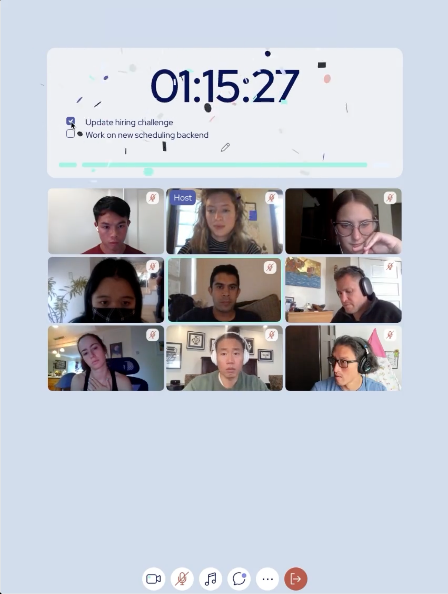

# README

Welcome to our front-end case study!

This code is a basic prototype to be used as a starting point. As you work, please commit regularly just as you would do on the job.

## Background

Imagine a scenario where you are working on the initial version of a product aimed at helping teams to stay focused and productive while working remotely. For the first iteration, we want to allow users to join a video call and share a status where they might set out goals for the session. We would expect each session to have a moderator from the team to keep everyone on track.

We initially implemented a very basic textarea to share what you're working working on in case members joined late, or couldn't participate in the verbal sharing for other reasons. In early user testing, we started noticing members using the status box for unexpected use cases: they would update it during the session as they decomposed their task into smaller pieces, or even create to-do lists to track what's been done and what's next. We've seen to-do lists implemented with everything from emojis like ☑️ and ✅ to markdown boxes like [ ] and [X] to creative usage of foreign characters like 口 and 区.

The very basic prototype for this challenge uses [Daily.co](https://www.daily.co/)'s prebuilt-UI to implement the video call feature, and a [Firebase Realtime Database](https://firebase.google.com/docs/database) for participants to share statuses with each other live. Your task is to take the emergent user behavior and build to-do list functionality into the prototype. An example mock-up of how we might envision this to eventually look is below:


## Getting Started

0. You should have node / npm and yarn installed already
1. Install dependencies with `yarn install`
2. Start development server with `yarn start`
    - If `yarn start` fails with `ERR_OSSL_EVP_UNSUPPORTED`, run ```export NODE_OPTIONS=--openssl-legacy-provider```

## Code Overview

- `./src/index.js` in the main entry point to the App
- `./src/components/Call.js` is where most of the logic for the video call lives. This handles joining the call, setting your status, and displaying statuses for other users on the call.
- `./src/utils/room.js` is what return your Daily.co room (see below). You shouldn't need to touch this file
- `./src/utils/firebase.js` contains shared logic for firebase, including your unique slug (see below)
- `./src/utils/daily.js` contains a few helper functions for interacting with Daily.co

### Daily.co

This code makes use of the [daily-js library](https://docs.daily.co/reference/daily-js) to handle the low level details of the video call. The current prototype uses the prebuilt iframe for the bulk of the UI. Daily.co will recognize multiple tabs as the same user, so the easiest way to join as multiple participants is to open a second private tab or use a different browser. You could also use the [addFakeParticipant](https://docs.daily.co/reference/daily-js/instance-methods/add-fake-participant) function. Note that the iframe doesn't always interact well with hot-reloading - you may need to refresh the page for the call to work properly after editing the code.

To make it easier for you to dive in, we've created several rooms for your usage so you don't have to register yourself on Daily.co. You will be assigned a room the first time you start the app. If you find you have a collision and are sharing a room with another applicant, you can delete the first line (`const ROOM_IDX = ...`) from `./src/utils/room.js` and start the app again.

### Firebase Realtime Database

This code uses a [Firebase Realtime Database (RTDB)](https://firebase.google.com/docs/database/web/start) to sync statuses in real time across participants in the video call. We have already configured the app to point to our own RTDB for simplicity.  
The first time you run the app you will be assigned a random slug. You can delete the first line in (`export const slug = ...`) from `./src/utils/firebase.js` and start the app again to reset it. The RTDB stores everything in a tree structure, you should nest all your storage under your slug (you can use the `firebaseSlugBase` function in `./src/utils/firebase.js` for this). If you find that you've corrupted the data under your slug, you can wipe it with [set](https://firebase.google.com/docs/database/web/read-and-write#write_data) (e.g. `set(firebaseSlugBase(), {})`).

## Next Steps

### Part 1 - Implementation

> estimated time: 60-90 minutes

- Based on the observed user behavior, we've written the following user stories:
  - In addition to their status, users should be able to save a list of to-do items
  - Users should be able to mark tasks on their to-do list as "done"
  - Users should be able to edit or delete items on the to-do list
  - To-do lists should be synced across all users in real time
- We don't expect you to be able to implement everything within the given time, but we'd like you to consider what is most important and see what progress you can make.
  - If you see other meaningful ways to improve the prototype that aren't captured in these user stories, feel free to work on them as well.

### Part 2 - Discussion

> estimated time: 15 minutes

Clear communication and decision-making are important skills for this role. To help us get a better sense of your thought process, please respond to the following questions about the time you spent in Part 1. Place your response in the `discussion.md` file.

- How did you prioritize your time?
- What decision points did you come to, and how did you reach the decision you made? Are there any questions you would have asked if you could?
- What would you do in this scenario if there was more time? What would come next? Is there anything you would change if you could do it again?

## Submitting your work

Compress the directory with all of your deliverables and follow the instructions provided in the case study email to upload your work.
